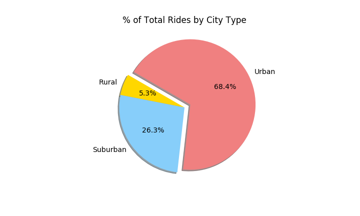
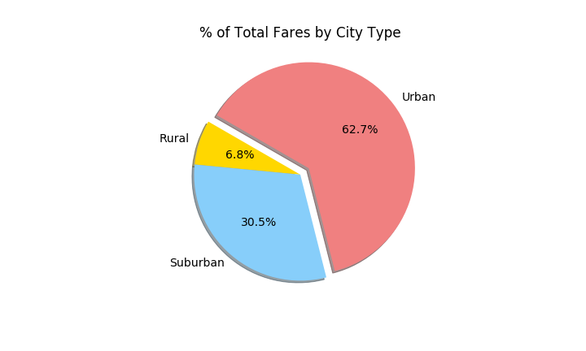

# PyBer Analysis
Performing an exploratory analysis and creating visualizations using rideshare data to help improve access to rideshare services and determine affordability for underserved areas.

---

# Challenge
The PyBer Summary DataFrame provides an overview comparison of PyBer's ridesharing services in three types of cities: rural, surburban, and urban cities. The summary demonstrates that there is larger demand for PyBer among riders in urban cities compared to suburban and rural cities. During this five-month period (January-May 2019), there were 1,625 rides in urban cities, 625 rides in suburban cities, and 125 rides in rural cities.

Similar to the number of rides, there is a larger volume of drivers in urban cities as well compared to suburban and rural cities. There were 2,405 drivers in urban cities, 490 drivers in suburban cities, and 78 drivers in rural cities.

Given that there is a greater usage of PyBer in urban cities, the total fares is consequently also higher than suburban and rural cities. PyBer transactions in urban cities totaled nearly $40,000 whereas transactions in urban cities and rural cities totaled at least $19,000 and $4,000 respectively.

✓ Summarizes data displayed in the DataFrame
✓ Summarizes the data displayed in the Multiple-line chart
✓ Explains the implication of the data summarized in the DataFrame ​and​ the Multiple-line chart
